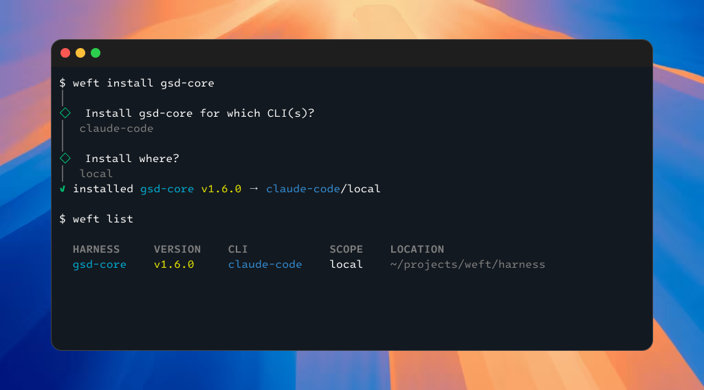

<p align="center">
  
</p>

<h1 align="center">weft</h1>

<p align="center">
  <strong>Homebrew for AI coding agents.</strong><br>
  Install skills, agents, commands, hooks, and MCP servers into your AI coding CLI with a single command.
</p>

<p align="center">
  <a href="https://www.npmjs.com/package/@goyoon/weft"></a>
  <a href="https://github.com/goyoon2/weft/actions/workflows/ci.yml"></a>
  <a href="./LICENSE"></a>
  
</p>

<p align="center">
  <a href="#install">Install</a> ·
  <a href="#quickstart">Quickstart</a> ·
  <a href="#what-can-i-install">Catalog</a> ·
  <a href="#how-it-works">How it works</a> ·
  <a href="#concepts">Concepts</a> ·
  <a href="#contributing">Contributing</a>
</p>

---

**weft** is a package manager for **harnesses** — installable bundles of skills, agents, slash
commands, hooks, and MCP servers that upgrade what your AI coding agent can do. Find one, install
it, and weft drops verified files into the right place for **Claude Code, Codex, Gemini, Cursor, or
opencode** — then `uninstall` and `upgrade` are exact, because every install is tracked.

```sh
npm install -g @goyoon/weft
weft install gsd-core
```

That's it. No cloning repos, no running a stranger's installer, no hand-copying files into
`~/.claude`. weft places **pre-built, verified** files and merges pre-computed config — and remembers
exactly what it wrote.

---

## Why weft?

The agent ecosystem ships its power as loose files — a `skills/` folder here, an `agents/` directory
there, an `mcp.json` snippet in a README. Trying one out usually means:

> clone the repo → read the README → run its bespoke install script → hope it supports *your* CLI →
> hand-copy files into the right config dir → and have no clean way to remove it later.

weft turns all of that into one line:

|  | Without weft | With weft |
|---|---|---|
| **Find** | Search GitHub, read READMEs | `weft search planner` *(typo-tolerant)* |
| **Install** | Run an unknown installer | `weft install gsd-core` — places **verified** files only |
| **Target a CLI** | Hope the project supports yours | One catalog → Claude Code, Codex, Gemini, Cursor, opencode |
| **Know what changed** | 🤷 | A **receipt** records every file and config fragment |
| **Remove / update** | Delete files by hand, miss some | `weft uninstall` / `weft upgrade` — exact, by provenance |

The catalog ships **inside the CLI as a snapshot**, so `weft search` and `weft catalog` work the
instant you install it — offline, no config — then auto-refresh in the background.

## Install

```sh
npm install -g @goyoon/weft
# or run without installing:
npx @goyoon/weft search planner
```

Requires **Node ≥ 22**.

## Quickstart

The full lifecycle — find, install, inspect, update, remove:

```sh
weft search planner          # find harnesses in the catalog (typo-tolerant)
weft catalog                 # browse everything available (instant, offline)
weft info gsd-core           # details + whether it's already installed

weft install gsd-core        # pick CLI + scope, merge the pre-built files in
weft list                    # what's installed, where

weft update                  # refresh the catalog from the mill (shows what changed)
weft upgrade gsd-core        # move every install to a newer version
weft uninstall gsd-core      # exact reverse of install — no leftovers
```

`install` is interactive by default — it asks **which CLI** (Claude Code, Codex, …) and **which
scope** (global or per-project), then shows you the plan. Scriptable too:

```sh
weft install gsd-core --cli claude-code --scope local --yes
weft install gsd-core --dry-run            # show the plan, write nothing
weft catalog --json | jq '.[].id'          # every command speaks --json
```

## Use cases

**🚀 Install a whole workflow system in one command.**
`weft install gsd-core` drops a complete spec-driven development system — agents, skills, slash
commands, and hooks — into your CLI of choice, instead of cloning a repo and wiring it up by hand.

**🧰 Grab a curated skill pack.**
`weft install anthropic-skills` adds Anthropic's official skills (Word/Excel/PowerPoint/PDF
processing, MCP-server building, skill authoring, web design, and more) to your agent in seconds.

**👥 Standardize tooling across a team.**
Install with `--scope local` to write into the project, not your home dir. Everyone runs the same
`weft install`, gets the same verified files, and `upgrade`/`uninstall` stay exact — no "works on my
machine" config drift.

**🔁 Use the same harness on every CLI.**
One catalog targets Claude Code, Codex, Gemini, Cursor, and opencode. Switch CLIs without hunting for
a port — weft places the right files for each.

**🧹 Try things fearlessly.**
Because every install is tracked by a receipt, `weft uninstall` is the *exact* reverse. Experiment,
then remove cleanly — your config dirs never accumulate mystery files.

## What can I install?

A growing catalog of community and official harnesses. A sample of what's available today:

| Harness | What it adds |
|---|---|
| [`gsd-core`](https://github.com/open-gsd/gsd-core) | Spec-driven development system — agents, skills, commands, hooks |
| [`anthropic-skills`](https://github.com/anthropics/skills) | Anthropic's official skills — document processing, MCP building, web design |
| [`mattpocock-skills`](https://github.com/mattpocock/skills) | Matt Pocock's engineering skills — TDD, bug diagnosis, domain modeling, PRDs |
| [`andrej-karpathy-skills`](https://github.com/multica-ai/andrej-karpathy-skills) | Behavioral guidelines that cut common LLM coding mistakes |
| [`ecc`](https://github.com/affaan-m/ECC) | A harness-native agent operating system across five CLIs |
| [`gstack`](https://github.com/garrytan/gstack) | Claude Code skills + a fast headless browser |

Run `weft catalog` for the full, up-to-date list.

## How it works

weft is split into the **CLI** and the **mill** — its registry, the
[`weft-mill`](https://github.com/goyoon2/weft-mill) repo.

The mill's CI does the dangerous part **once, in a sandbox**: it runs each harness's own installer (or
applies its declarative recipe), normalizes the result, and publishes a **spool** — a pre-built,
ready-to-merge snapshot for every `(harness, version, CLI, scope)`. Your machine **never runs a
harness's own installer**. `weft install` only:

1. **places** verified files into the right config dir for your CLI, and
2. **merges** pre-computed config fragments (MCP servers, hooks) into existing JSON,

writing a **receipt** under `~/.weft/` that records exactly what landed — which is what makes
`uninstall` and `upgrade` exact rather than best-effort.

> The rare harness that *must* run its own installer (a "delegated"/cask harness) is clearly flagged
> and never runs unattended — weft prompts for consent, or requires an explicit `--trust`.

## Concepts

weft borrows Homebrew's mental model:

| weft | Homebrew analogue | what it is |
|---|---|---|
| **harness** | — | the thing you install (e.g. `gsd-core`) |
| **mill** | homebrew-core | the registry repo ([`weft-mill`](https://github.com/goyoon2/weft-mill)) holding patterns |
| **pattern** | formula | a harness recipe in the mill (`patterns/<id>.yaml`) |
| **spool** | bottle | a pre-built, normalized, ready-to-merge snapshot per `(harness, version, cli, scope)` |
| **index** | — | the catalog `weft update` downloads |
| **receipt** | INSTALL_RECEIPT | the exact record of one install, under `~/.weft/` |

## Command reference

| Command | Does |
|---|---|
| `weft search <query>` | Find harnesses in the catalog (typo-tolerant) |
| `weft catalog` | List every harness available in the mill |
| `weft info <harness>` | Show details and install state for a harness |
| `weft install <harness>` | Install a harness (asks which CLI + scope unless given) |
| `weft list` | List installed harnesses (`--all` for every project) |
| `weft update` | Refresh the catalog from the mill (shows what changed) |
| `weft upgrade <harness>` | Upgrade every install of a harness to the latest version |
| `weft uninstall <harness>` | Remove a harness install — the exact reverse |

Every command takes `--json` for scripting. Run `weft --help` or `weft <command> --help` for options.

### Configuration

| Env var | Effect |
|---|---|
| `WEFT_NO_AUTO_UPDATE=1` | Pin the bundled catalog snapshot; don't auto-refresh |
| `WEFT_INDEX_URL=<url>` | Point at a different catalog `index.json` |
| `WEFT_MILL_DIR=<path>` | Resolve the catalog from a local mill checkout |

## Contributing

Want to add a harness to the catalog? Author a **pattern** in the
[`weft-mill`](https://github.com/goyoon2/weft-mill) registry — a single `patterns/<id>.yaml` that
points at the source and tells the mill how to build spools. CI does the rest. Bug reports and
feature requests are welcome in [issues](https://github.com/goyoon2/weft/issues).

## Development

This repo is a pnpm workspace:

| Package | Role |
|---|---|
| `@weft/schema` | types, zod validators, hashing, placeholder substitution |
| `@weft/adapters` | the `CliAdapter` seam + per-CLI adapters (Claude Code, Codex, Gemini, Cursor, opencode) |
| `@weft/loom` | the spool builder (`pattern` → `spool`) |
| `@weft/core` | resolve, plan, transactional place/merge, receipts, ops |
| `@goyoon/weft` | the `weft` CLI |

```sh
pnpm install
pnpm typecheck
pnpm test
pnpm weft -- search gsd      # run the CLI from source
```

The registry data lives in the sibling [`weft-mill`](https://github.com/goyoon2/weft-mill) repo.

## License

[MIT](./LICENSE)
